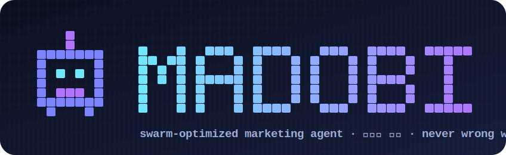

<div align="center">



# Swarm Agent Lab

**An agent that earns its intelligence — selected by evolutionary swarm optimization, not hand-tuned.**

*112 candidate strategies → code-verified benchmark → 4-generation tournament → a champion that never gets the numbers wrong.*

`evolutionary prompt optimization` · `Doer–Verifier swarm` · `marketing analytics specialization`

</div>

---

## What is this?

Most "agentic" systems ship a **hand-written** system prompt and hope it's good. **Swarm Agent Lab** instead *measures* its way to the best operating strategy:

1. A **Designer swarm** generates **112 distinct operating manuals** across 14 strategy families.
2. Each is scored on a **code-verified benchmark** (20 problems whose answers are computed by Python — deterministic, no LLM judging).
3. Four generations of **evolutionary tournament** (screen → finals → tie-break) crown a champion.
4. The winning strategy is packaged into a reusable **agent + skill**, and specialized for **marketing analytics**, where getting numbers *right* is everything.

> **Headline result:** the winning **verification-first** strategy + **majority-vote** reaches **perfect accuracy even on heavy arithmetic** — the exact failure mode that makes generic agents "get the numbers wrong" in spreadsheet/campaign analysis.

## 🏆 Key results

| Stage | What | Outcome |
|-------|------|---------|
| Gen 1 | 4 seed strategies × 10 problems | naive decomposition **hurts** heavy arithmetic; verification **fixes** it |
| Gen 2 | **112 designs** × hard subset (5 parallel shards) | verification family dominates; 13 perfect |
| Gen 3 | Finals: 12 finalists × 20 problems | **4 designs score 20/20** |
| Gen 4 | Tie-break: 4 champions × error-prone × 5 trials | champion **`F03_adversarial_c`** (29/30 single-shot); **majority-vote → 6/6 perfect** |

**Recipe that wins:** `decompose → independent self-verification → adversarial refutation → majority vote`.

## 🤖 The agents

| Agent | Role |
|-------|------|
| [`smartest`](.claude/agents/smartest.md) | General swarm/team orchestrator: parallel Solver swarm → Verifier swarm → Synthesizer |
| [`madup-marketer`](.claude/agents/madup-marketer.md) | Marketing-specialized: **number reconciliation**, creative lifecycle, growing knowledge assets |

Plus a ready-to-use Claude Code skill: [`marketing-analyst`](.claude/skills/marketing-analyst/SKILL.md).

## 📊 Marketing specialization — "never gets the numbers wrong"

The #1 complaint about AI in marketing is **wrong numbers** in spreadsheet summaries and campaign analysis. The champion's verification swarm maps directly onto **number reconciliation (정합성)**:

- **`marketing/reconcile.py`** — a working consistency engine: recomputes CTR/CPC/CPM/CPA/ROAS from raw, checks **breakdown sums = totals**, catches the **simple-vs-weighted average (Simpson) trap**, normalizes units/currency.
- **Knowledge assets that grow with use** — `METRICS.md` (formulas + reconciliation invariants), `CREATIVE_PLAYBOOK.md` (creative plan → generate → QA), `MEMORY_PROTOCOL.md` (per-account learnings that compound).

```text
$ python marketing/reconcile.py marketing/sample_campaign.csv
-- checks: 16 PASS, 2 WARN --
  ! [C_carousel] ctr: reported=9.9% recomputed=5.0000%
  ! [SUM] spend: rows_sum=4,100,000 vs total_row=4,200,000
VERDICT: 2 INCONSISTENCY(IES) - investigate raw data
```
*(Two planted errors caught, zero false positives.)*

## 🔢 Aggregation benchmark — "never wrong, at scale"

Getting numbers right on **large, many-field, messy** data is the hard part. So we prove it:

- **`marketing/bench/`** generates a **100,000-row × 13-field** dataset (commas, ₩, mixed formatting) with **code-computed ground truth**, then a **30-level difficulty ladder** checks aggregation — single & **multi-pivot (up to an "absurd" 4-dimension, 225-group pivot)**, filters, top-N / bottom-N, having, weekly rollups, share-of, derived-of-derived. Every level is cross-checked **two independent ways** + a **re-sum invariant**.

```text
$ python marketing/bench/gen_dataset.py --rows 100000 && python marketing/bench/levels.py
=== GRADED BENCHMARK: 29/29 levels PASS ===
✅ ALL LEVELS PASS — multi-pivot/filters/top-N/absurd 4D aggregation all exact.
```

For *reasoning* (not aggregation), the agent escalates to **CoT + parallel majority-vote** — the recipe proven to hit perfect accuracy even on heavy arithmetic.

## 🔁 Self-improving loop (grows with you)

When you say *"improve this / always do X / that's wrong"*, the agent **captures the feedback → promotes it to a knowledge asset → logs it → commits to git** (globally if it's a central rule):

```bash
python learn.py --feedback "ROAS는 항상 배수(x)로 표기" --scope global --tag report --commit
```

So the repo itself becomes the team's compounding, version-controlled knowledge base. See [`marketing/LEARNING_LOOP.md`](marketing/LEARNING_LOOP.md).

## ⚡ Use it in Claude Code (directly)

The agents and skill live under `.claude/` — **Claude Code auto-loads them**, no install step:

```bash
git clone https://github.com/hyunseokjeong-madup/swarm-agent-lab
cd swarm-agent-lab
claude            # the `smartest` / `madup-marketer` agents + `marketing-analyst` skill are now available
```

To use them in **another project**, copy the folders into that project (or your user scope `~/.claude/`):
```bash
cp -r .claude/agents/*  <your-project>/.claude/agents/
cp -r .claude/skills/*  <your-project>/.claude/skills/
cp -r marketing/        <your-project>/        # knowledge assets + reconcile/summarize tools
```
Then just ask: *"이 캠페인 CSV 요약하고 숫자 검산해줘"* → it reconciles before reporting.
Improvements you give it auto-commit to the repo (`learn.py`, auto-push ON by default).

## 🚀 Quickstart

```bash
# 1. Build the verified benchmark (answers computed by code)
python benchmark/build_benchmark.py

# 2. Reconcile a marketing spreadsheet
python marketing/reconcile.py marketing/sample_campaign.csv

# 3. Score an evaluation run
python score.py results/gen1.json
python track.py        # fitness over generations
```

In **Claude Code**, the agents and the `marketing-analyst` skill auto-load from `.claude/`.
Ask: *"Summarize this campaign CSV and check the numbers"* → it reconciles before reporting.

## 🗂 Repository layout

```
.claude/agents/        smartest.md, madup-marketer.md
.claude/skills/        marketing-analyst/SKILL.md
benchmark/             build_benchmark.py, problems.json, answers.json   (code-verified)
designs/               seed strategies + PLANNER role
marketing/             STRATEGY, METRICS, CREATIVE_PLAYBOOK, MEMORY_PROTOCOL, reconcile.py
results/               every generation's raw data + rankings
make_eval_script.py    emits self-contained swarm-eval workflows
merge_and_rank.py      merge shards → majority-vote → rank
optimization_log.md    the Planner's journal (process + lessons, every generation)
KNOWHOW.md             compounding knowledge base
ADVANTAGES.md          vs Hermes Agent / Pi Agent
REPORT.md              full write-up
```

## 🧬 How the optimization works

```
Planner ─▶ Designer swarm (112 manuals, 14 families)
            │
            ▼
        Evaluator swarm (design × problem, closed-book) ─▶ deterministic scoring
            │
            ▼
        Analyst ─▶ select elites ─▶ mutate/recombine ─▶ next generation
            │
            └── converge ─▶ Synthesizer ─▶ champion agent + skill
```

Built on Anthropic's [Building Effective Human-Agent Teams](https://claude.com/blog/building-effective-human-agent-teams) principles: **Doer–Verifier**, hierarchical agents, parallel workstreams, reflection cycles, externalized knowledge.

## 🆚 Why it's stronger than single-loop agents

Versus **Hermes Agent** (Nous) and **Pi Agent** — both single-agent loops — Swarm Agent Lab adds four structural edges: **evidence-based strategy**, **verification-swarm robustness**, **parallel orchestration**, and a **compounding knowledge base**. Details in [`ADVANTAGES.md`](ADVANTAGES.md).

## 📜 License

MIT — see [LICENSE](LICENSE).

<div align="center"><sub>Built with Claude Code · evolutionary swarm optimization</sub></div>
